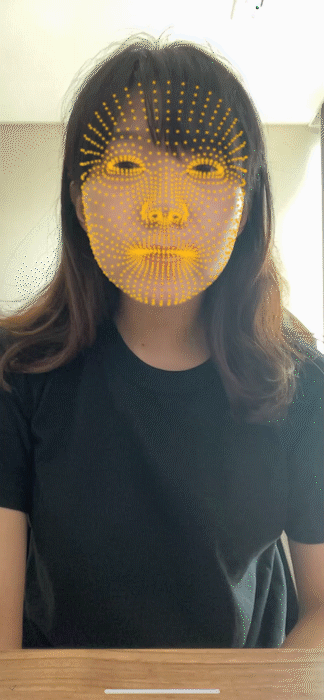

# AR-Course-CJU

# Image Tracking

### Single Image Tracking + Animated 3D Object

### Single Image Tracking + Video

### Multiple Image Tracking

# Face Tracking 

### Mask Material

### Face Tracking with Mask Material

### Face Tracking with 3D Objects

# Plane Tracking

### Default Plane Tracking

### Plane Tracking + Touch Event

### Plane Tracking + AR Raycast

# Control AR Object

### Move

### Occlusion

### Scale & Rotation

### Multiple Objects

